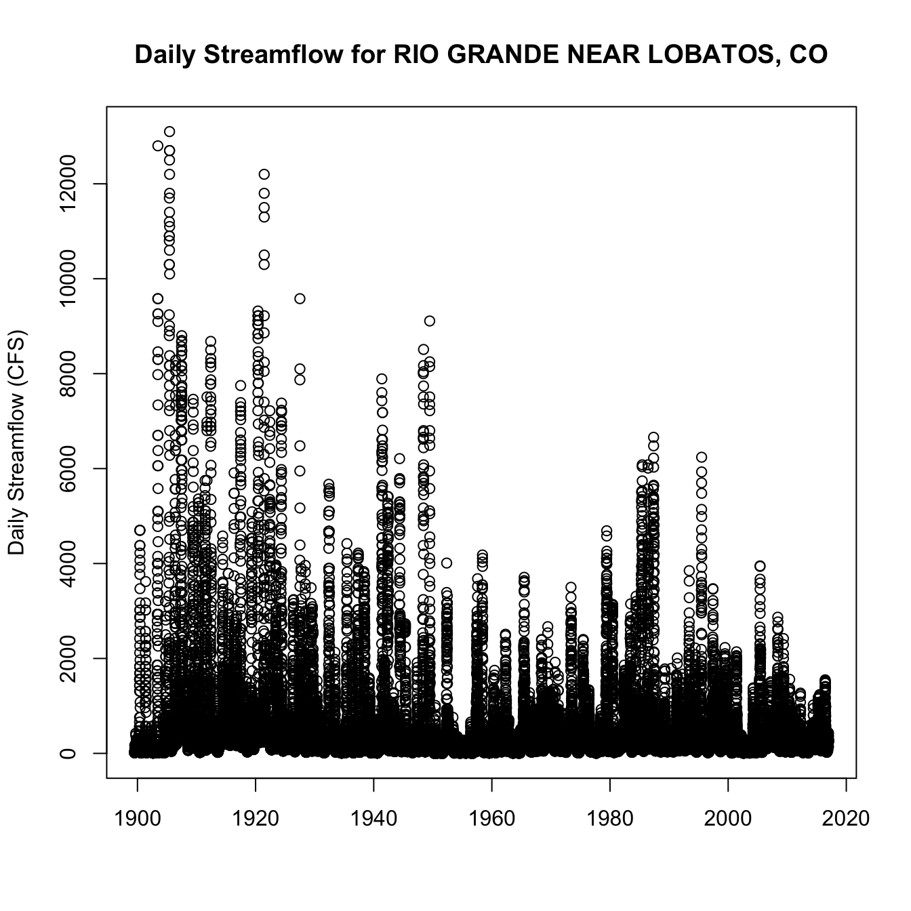

Introduction
------------

The Hydro [Network-Linked Data Index (NLDI)](https://cida.usgs.gov/nldi/about) is a system that can index data to [NHDPlus V2](http://www.horizon-systems.com/NHDPlus/V2NationalData.php) catchments and offers a search service to discover indexed information. Data linked to the NLDI includes [active NWIS stream gages](https://waterdata.usgs.gov/nwis/rt), [water quality portal sites](https://www.waterqualitydata.us/), and [outlets of HUC12 watersheds](https://www.sciencebase.gov/catalog/item/5762b664e4b07657d19a71ea). The NLDI is a core product of the [Open Water Data Initiative](http://acwi.gov/spatial/owdi/) and is being developed as [an open source project.](https://github.com/ACWI-SSWD) coordinated through the [Advisory Committee on Water Information (ACWI) Subcommittee on Spatial Water Data](http://acwi.gov/spatial).

In this blog post, we introduce the basic functions of the NLDI and show how to use it as a data discovery and access tool in R. The first section describes the operations available from the [NLDI's Web API](https://cida.usgs.gov/nldi/swagger-ui.html). The second section shows how to map NLDI data and how to use the NLDI to discover data to be accessed with [the dataRetrieval package.](https://owi.usgs.gov/R/dataRetrieval.html)

The NLDI Web API
----------------

The NLDI's Web API follows a losely RESTful design and is documented with [swagger](http://swagger.io/) documentation which can [be found here.](https://cida.usgs.gov/nldi/swagger-ui.html) Every request to get data from the NLDI starts from a given network linked feature.

In this post, we use text highlighting in six ways.
1) The names of API parameters such as `{featureSource}`.
2) Example values of API parameters such as: `USGS-08279500`
3) API operation names: ***navigation*** and ***basin***
4) API request names such as: *getDataSources*
5) R functions such as: **readOGR**
6) Other specific strings such as "siteNumber"

### Feature Sources

Available network linked feature sources (`{featureSource}`s) can be found from the [*getDataSources* request.](https://cida.usgs.gov/nldi/swagger-ui.html#!/lookup-controller/getDataSourcesUsingGET) (hint: Click the "try it out" button on the swagger page!) These are the collections of network linked features the NLDI knows about. Think of them as watershed outlets that can be used as a starting point. For this demo, we'll use NWIS Stream Gages as the `{featureSource}`. As a note for later, `{featureSource}` here is the same as the `{dataSource}` described below.

### Feature IDs

For now, the particular `{featureID}` to be accessed from a given `{featureSource}` needs to be found outside the NLDI, so the [*getFeatures*](https://cida.usgs.gov/nldi/swagger-ui.html#!/lookup-controller/getFeaturesUsingGET_1) request doesn't return anything. So let's use a [well known NWIS Streamgage](https://www.usgs.gov/news/first-usgs-streamgage-records-125-years-measuring-new-mexico%E2%80%99s-vital-water-resources) on the [Rio Grande at Embudo NM](https://waterdata.usgs.gov/nwis/inventory/?site_no=08279500&agency_cd=USGS) as our starting point.


### Indexed Features

We can use the [*getRegisteredFeature*](https://cida.usgs.gov/nldi/swagger-ui.html#!/lookup-controller/getRegisteredFeatureUsingGET) request to see this feature. Enter `nwissite` and `USGS-08279500` in the `{featureSource}` and `{featureID}`, respectively, in the [swagger demo page.](https://cida.usgs.gov/nldi/swagger-ui.html#!/lookup-controller/getRegisteredFeatureUsingGET) You can also see this in your browser at this url: <https://cida.usgs.gov/nldi/nwissite/USGS-08279500> The response contains the location of the feature, is in [geojson](http://geojson.org/), and looks like:

    {
      "type": "FeatureCollection",
      "features": [
        {
          "type": "Feature",
          "geometry": {
            "type": "Point",
            "coordinates": [
              -105.9639722,
              36.20555556
            ]
          },
          "properties": {
            "source": "nwissite",
            "sourceName": "NWIS Sites",
            "identifier": "USGS-08279500",
            "name": "RIO GRANDE AT EMBUDO, NM",
            "uri": "https://waterdata.usgs.gov/nwis/inventory?agency_code=USGS&site_no=08279500",
            "comid": "17864756",
            "navigation": "https://cida.usgs.gov/nldi/nwissite/USGS-08279500/navigate"
          }
        }
      ]
    }

    ## OGR data source with driver: GeoJSON 
    ## Source: "https://cida.usgs.gov/nldi/nwissite/USGS-08279500", layer: "OGRGeoJSON"
    ## with 1 features
    ## It has 7 fields

    ## OGR data source with driver: GeoJSON 
    ## Source: "https://cida.usgs.gov/nldi/nwissite/USGS-08279500/navigate/UM?distance=150", layer: "OGRGeoJSON"
    ## with 58 features
    ## It has 1 fields

    ## OGR data source with driver: GeoJSON 
    ## Source: "https://cida.usgs.gov/nldi/nwissite/USGS-08279500/navigate/UM/nwissite?distance=150", layer: "OGRGeoJSON"
    ## with 4 features
    ## It has 7 fields

    ## OGR data source with driver: GeoJSON 
    ## Source: "https://cida.usgs.gov/nldi/nwissite/USGS-08279500/basin", layer: "OGRGeoJSON"
    ## with 1 features
    ## It has 0 fields

<iframe seamless src="/static/nldi-intro/map_1/index.html" width="60%" height="500">
</iframe>
Note: The second section of this blog post shows how to make maps of NLDI like this in R.

### Navigation

The ***navigation*** property of the returned feature is a url for the [*getNavigationTypes*](https://cida.usgs.gov/nldi/swagger-ui.html#!/lookup-controller/getNavigationTypesUsingGET) request. This request provides four ***navigation*** options as shown below. Each of these URLs returns the NHDPlus flowlines for the navigation type.

    {
      "upstreamMain": "https://cida.usgs.gov/nldi/nwissite/USGS-08279500/navigate/UM",
      "upstreamTributaries": "https://cida.usgs.gov/nldi/nwissite/USGS-08279500/navigate/UT",
      "downstreamMain": "https://cida.usgs.gov/nldi/nwissite/USGS-08279500/navigate/DM",
      "downstreamDiversions": "https://cida.usgs.gov/nldi/nwissite/USGS-08279500/navigate/DD"
    }

### Get Flowlines from Navigation

Each of the URLs found via the *getNavigationTypes* request is a complete [*getFlowlines*](https://cida.usgs.gov/nldi/swagger-ui.html#!/linked-data-controller/getFlowlinesUsingGET) request. This request has some optional input parameters. The most useful being `{distance}`, which allows specification of a distance to navigate in km. So, for example, we can use this to retrieve 150km of upstream mainstem flowlines from the NWIS gage 08279500 with a request like: <https://cida.usgs.gov/nldi/nwissite/USGS-08279500/navigate/UM?distance=150>

<iframe seamless src="/static/nldi-intro/map_2/index.html" width="60%" height="500">
</iframe>
Notice that the flowline goes downstream of the gage because the NLDI is referenced to whole NHDPlus catchments, not to precise network locations.

### Get Linked Data from Navigation

Now that we have a `{featureSource}` = `nwissite`, a `{featureID}` = `USGS-082795001`, the ***navigate*** operation on the feature, and the `{navigationMode}` = `UM` with `{distance}` = `10`km, we can use the [*getFeatures*](https://cida.usgs.gov/nldi/swagger-ui.html#!/linked-data-controller/getFeaturesUsingGET) request to discover features from any `{featureSource}` which, in the context of a *getFeatures* request is called a `{dataSource}`. Setting the `{dataSource}` = `nwissite`, we can see if there are any active NWIS streamgages 150km upstream on the main stem with a request that looks like: <https://cida.usgs.gov/nldi/nwissite/USGS-08279500/navigate/UM/nwissite?distance=150> Note that we could enter `wqp` in place of `nwissite` after `UM` here to get [water quality portal](https://www.waterqualitydata.us/) sites instead of NWIS sites. An example of this is shown later in this post.

<iframe seamless src="/static/nldi-intro/map_3/index.html" width="60%" height="500">
</iframe>
Note: Click the black NWIS gage to see a pop up and link!

### Get the Upstream Basin Boundary

So far, we've covered four parameters of the NLDI Web API. The two base parameters, `{featureSource}` and `{featureID}`, and two that apply to the ***navigate*** option, `{navigationMode}` and `{distance}`. In addition to the ***navigate*** option, the NLDI offers a ***basin*** option for any `{featureSource}`/`{featureID}`. The [*getBasin*](https://cida.usgs.gov/nldi/swagger-ui.html#!/characteristics-controller/getBasinUsingGET) operation doesn't require any additional parameters, so a request to get the basin for our stream gage liiks like: <https://cida.usgs.gov/nldi/nwissite/USGS-08279500/basin>.

<iframe seamless src="/static/nldi-intro/map_4/index.html" width="60%" height="500">
</iframe>
### NLDI API Summary

There are a few other options available from the NLDI that are not covered here. One, that is coming soon, will make catchment (local incremental NHDPlus catchment) and basin (upstream accumulation) landscape characteristics available. This functionality and data is available but is preliminary and subject to change. There are also two options on the ***navigate*** option, `{legacy}` and `{stopComid}`, that are preliminary and subject to change.

Bringing together all the operations summarized above, we can get:
1) The NWIS site: <https://cida.usgs.gov/nldi/nwissite/USGS-08279500>
2) The basin upstream of the site: <https://cida.usgs.gov/nldi/nwissite/USGS-08279500/basin>
3) All upstream with tributaries flowlines: <https://cida.usgs.gov/nldi/nwissite/USGS-08279500/navigate/UT>
4) The upstream mainstem flowlines: <https://cida.usgs.gov/nldi/nwissite/USGS-08279500/navigate/UM>
5) The downstream mainstem flowlines: <https://cida.usgs.gov/nldi/nwissite/USGS-08279500/navigate/DM>
6) The water quality observation sites in upstream catchments: <https://cida.usgs.gov/nldi/nwissite/USGS-08279500/navigate/UT/wqp>
7) The water quality observations in downstream catchments: <https://cida.usgs.gov/nldi/nwissite/USGS-08279500/navigate/DM/wqp>

For [QGIS](http://qgis.org/en/site/) users, you can use the NLDI URLs directly in the "Add Vector Layer" dialogue. The following two screenshots were rendered by loading the data into QGIS, turning on a base map with the OpenLayers Plugin, and applying a little styling to the NLDI layers. No local files needed!

   
*Screenshots of NLDI data loaded into QGIS.*

Using the NLDI in R.
--------------------

Starting from the [recent blog post](https://owi.usgs.gov/blog/basemaps/) showing how to use National Map basemaps with leaflet in R, we can map some data retrieved from the NLDI in R. In the code below, the leaflet object `map` created the the National Map basemap blog post was wrapped up into the `get_base_map()` function called in the code shown below.

First, we get all our URLs into a list and use **readOGR** from the [rgdal](https://cran.r-project.org/web/packages/rgdal/index.html) package to download and read all the data into spatial data types. The end of this code block creates html for popup text with a web link tag that we'll use later.

``` r
nldiURLs <- list(site_data = "https://cida.usgs.gov/nldi/nwissite/USGS-08279500",
             basin_boundary = "https://cida.usgs.gov/nldi/nwissite/USGS-08279500/basin",
             UT = "https://cida.usgs.gov/nldi/nwissite/USGS-08279500/navigate/UT",
             UM = "https://cida.usgs.gov/nldi/nwissite/USGS-08279500/navigate/UM",
             DM = "https://cida.usgs.gov/nldi/nwissite/USGS-08279500/navigate/DM",
             UTwqp = "https://cida.usgs.gov/nldi/nwissite/USGS-08279500/navigate/UT/wqp",
             DMwqp = "https://cida.usgs.gov/nldi/nwissite/USGS-08279500/navigate/DM/wqp")

nldi_data <- list()

for(n in names(nldiURLs)) {
  nldi_data[n] <- rgdal::readOGR(dsn = nldiURLs[n][[1]], layer = "OGRGeoJSON")
  print(paste(n, "is of class", class(nldi_data[n][[1]])[1], "and has", length(nldi_data[n][[1]]), "features"))
}
```

    ## OGR data source with driver: GeoJSON 
    ## Source: "https://cida.usgs.gov/nldi/nwissite/USGS-08279500", layer: "OGRGeoJSON"
    ## with 1 features
    ## It has 7 fields
    ## [1] "site_data is of class SpatialPointsDataFrame and has 1 features"
    ## OGR data source with driver: GeoJSON 
    ## Source: "https://cida.usgs.gov/nldi/nwissite/USGS-08279500/basin", layer: "OGRGeoJSON"
    ## with 1 features
    ## It has 0 fields
    ## [1] "basin_boundary is of class SpatialPolygonsDataFrame and has 1 features"
    ## OGR data source with driver: GeoJSON 
    ## Source: "https://cida.usgs.gov/nldi/nwissite/USGS-08279500/navigate/UT", layer: "OGRGeoJSON"
    ## with 3371 features
    ## It has 1 fields
    ## [1] "UT is of class SpatialLinesDataFrame and has 3371 features"
    ## OGR data source with driver: GeoJSON 
    ## Source: "https://cida.usgs.gov/nldi/nwissite/USGS-08279500/navigate/UM", layer: "OGRGeoJSON"
    ## with 184 features
    ## It has 1 fields
    ## [1] "UM is of class SpatialLinesDataFrame and has 184 features"
    ## OGR data source with driver: GeoJSON 
    ## Source: "https://cida.usgs.gov/nldi/nwissite/USGS-08279500/navigate/DM", layer: "OGRGeoJSON"
    ## with 1367 features
    ## It has 1 fields
    ## [1] "DM is of class SpatialLinesDataFrame and has 1367 features"
    ## OGR data source with driver: GeoJSON 
    ## Source: "https://cida.usgs.gov/nldi/nwissite/USGS-08279500/navigate/UT/wqp", layer: "OGRGeoJSON"
    ## with 1908 features
    ## It has 7 fields
    ## [1] "UTwqp is of class SpatialPointsDataFrame and has 1908 features"
    ## OGR data source with driver: GeoJSON 
    ## Source: "https://cida.usgs.gov/nldi/nwissite/USGS-08279500/navigate/DM/wqp", layer: "OGRGeoJSON"
    ## with 2756 features
    ## It has 7 fields
    ## [1] "DMwqp is of class SpatialPointsDataFrame and has 2756 features"

``` r
UTwqp_html <- paste('<a href="',
                      nldi_data$UTwqp@data$uri,
                      '"  target="_blank">',
                      nldi_data$UTwqp@data$name,
                      '</a>')

DMwqp_html <- paste('<a href="',
                      nldi_data$DMwqp@data$uri,
                      '"  target="_blank">',
                      nldi_data$DMwqp@data$name,
                      '</a>')
```

Now that we have all our data, we can use leaflet functions to add the data to a map. First, let's map just the upstream data. Note that the order we add them determines the order the layers are drawn. You can zoom in on the map shown and click the water quality sites to get a popup containing a link to the site's landing page.

``` r
map <- get_base_map()

map <- leaflet::addPolygons(map, 
                            data=nldi_data$basin_boundary, 
                            color = "black", 
                            fill = FALSE, 
                            weight = 1,
                            opacity = 1)

map <- leaflet::addPolylines(map, 
                             data = nldi_data$UT,
                             color = "blue",
                             weight = 1,
                             opacity = 1)

map <- leaflet::addPolylines(map,
                             data = nldi_data$UM, 
                             color = "blue", 
                             weight = 3, 
                             opacity = 0.5)

map <- leaflet::addCircleMarkers(map = map,
                                 data = nldi_data$UTwqp,
                                 radius = 1,
                                 color = "black",
                                 opacity = .5,
                                 fill = FALSE, 
                                 popup = UTwqp_html)

map <- leaflet::addCircleMarkers(map, 
                                 data = nldi_data$site_data, 
                                 radius = 5, 
                                 color = "red")
```

<iframe seamless src="/static/nldi-intro/map_5/index.html" width="60%" height="500">
</iframe>
To complete the picture, we can add the downstream main stem and water quality sites. Now we have an interactive map of all the upstream tributaries, water quality sites, basin boundary, the entire main stem, and water quality sites downstream.

``` r
map <- leaflet::addPolylines(map,
                             data = nldi_data$DM, 
                             color = "blue", 
                             weight = 3, 
                             opacity = 0.5)
map <- leaflet::addCircleMarkers(map = map,
                                 data = nldi_data$DMwqp,
                                 radius = 1,
                                 color = "black",
                                 opacity = .5,
                                 fill = FALSE, 
                                 popup = DMwqp_html)
```

<iframe seamless src="/static/nldi-intro/map_6/index.html" width="60%" height="500">
</iframe>
This final map illustrates a very important detail about the NLDI if you zoom in on the downstream main stem. Notice that the sites are not all **on** the main stem flowpath. When the system indexes data sources that aren't already indexed to particular reachcodes and measures along those reaches, it links sites (points) by looking at what local catchment polygon the site is in. This means that sites found through navigation may not be **on** the main flowpath of a catchment. In the future, we hope to improve the system such that it would know if indexed data are **on** or **off** the main flowpath of a catchment, but for now users need to be aware of this limitation.

### Using the NLDI to discover linked observations data.

The two sources of linked data shown above, `nwissite` and `wqp`, are both queryable from [the dataRetrieval package.](https://owi.usgs.gov/blog/tags/dataretrieval/) The "siteNumber" input of the dataRetrieval functions that start with "readNWIS" can be found by removing "USGS-" from the "identifier" attribute of features found using `nwissite` as the `{dataSource}` input. The following code shows the NLDI identifiers and how to use them with the dataRetrieval function **readNWISdv**.

``` r
nwis_ids <- as.character(nwis_gages@data$identifier)
print(paste("The NLDI ID for:", nwis_gages@data$name, "is", nwis_ids))
```

    ## [1] "The NLDI ID for: RIO GRANDE NEAR LOBATOS, CO is USGS-08251500"                      
    ## [2] "The NLDI ID for: RIO GRANDE NEAR CERRO, NM is USGS-08263500"                        
    ## [3] "The NLDI ID for: RIO GRANDE BLW TAOS JUNCTION BRIDGE NEAR TAOS, NM is USGS-08276500"
    ## [4] "The NLDI ID for: RIO GRANDE AT EMBUDO, NM is USGS-08279500"

``` r
nwis_ids <- gsub(pattern = "USGS-", replacement = "", nwis_ids)
print(paste(nwis_gages@data$name, "has id", nwis_ids))
```

    ## [1] "RIO GRANDE NEAR LOBATOS, CO has id 08251500"                      
    ## [2] "RIO GRANDE NEAR CERRO, NM has id 08263500"                        
    ## [3] "RIO GRANDE BLW TAOS JUNCTION BRIDGE NEAR TAOS, NM has id 08276500"
    ## [4] "RIO GRANDE AT EMBUDO, NM has id 08279500"

``` r
# Now we can use these IDs with dataRetrieval.
dv_data <- dataRetrieval::readNWISdv(siteNumber = nwis_ids[1], parameterCd = '00060')
plot(dv_data$Date, dv_data$X_00060_00003, 
     main = paste("Daily Streamflow for", nwis_gages@data$name[1]), xlab = "", ylab = "Daily Streamflow (CFS)")
```


<p class="caption">
Daily Streamflow Plot
</p>

Similarly, we can use identifiers returned using `wqp` as the `{dataSource}` with the **readWQPqw** function. In this case, the identifiers can be used without modification as shown below. Note that the NLDI query for downstream mainstem found 2756 sites and upstream tributaries found 1908 sites. The query below gets data from just one! The NLDI is used as a spatial pre-filter in the [Water Quality Portal user interface](https://www.waterqualitydata.us/portal/), which has a rich set of filter options in addition to network navigation.

``` r
wqp_site <- list(names = as.character(nldi_data$DMwqp@data$name), 
                 ids = as.character(nldi_data$DMwqp@data$identifier))
print(paste(wqp_site$names[1:10], "has id", wqp_site$ids[1:10]))
```

    ##  [1] "RIO GRANDE BOR SITE 1 NR ISLETA, NM, has id USGS-08330961"              
    ##  [2] "Montoya Drain ABV Montoya Rd, El Paso, TX has id USGS-315230106355110"  
    ##  [3] "MBOWN-188 - 28S.03E.09.1324 has id USGS-315318106384301"                
    ##  [4] "Vinton Drain at Nemexas Drain nr Vinton, TX has id USGS-315642106371110"
    ##  [5] "26S.03E.16.423 has id USGS-320236106380701"                             
    ##  [6] "26S.03E.08.143 has id USGS-320340106394201"                             
    ##  [7] "MBOWN-77 - 24S.02E.17.423B (M-3B) has id USGS-321304106451503"          
    ##  [8] "M-4 Gravity Site has id USGS-321332106443704"                           
    ##  [9] "23S.01E.17.423 has id USGS-321814106512601"                             
    ## [10] "23S.01E.04.114 has id USGS-322030106510201"

``` r
wqp_data <- dataRetrieval::readWQPqw(siteNumbers = wqp_site$ids[1:10], parameterCd = "")
print(paste0("Got ", ncol(wqp_data), " samples beween ", min(wqp_data$ActivityStartDate), " and ", max(wqp_data$ActivityStartDate), " for characteristics: ", paste(unique(wqp_data$CharacteristicName), collapse = ", ")))
```

    ## [1] "Got 65 samples beween 1972-11-01 and 2013-02-27 for characteristics: Selenium, Boron, Zinc, Arsenic, Silver, Mercury, Lead, Manganese, Iron, Copper, Chromium(VI), Chromium, Cadmium, Orthophosphate, Barium, Sulfate, Inorganic nitrogen (nitrate and nitrite), Silica, Hydrogen ion, Chloride, Fluoride, Carbonate, Bicarbonate, Carbon dioxide, Alkalinity, total, Sodium, percent total cations, Sodium, Sodium adsorption ratio [(Na)/(sq root of 1/2 Ca + Mg)], Potassium, Hardness, non-carbonate, Calcium, pH, Magnesium, Total dissolved solids, Specific conductance, Bromide, Hardness, Ca, Mg, Stream flow, instantaneous, RBP Stream width, Temperature, water, Temperature, air, deg C, Oxygen, Depth, Depth to water level below land surface, Depth, from ground surface to well water level, Flow rate, instantaneous, Oil and Grease, Detergent, severity (choice list), Floating Garbage Severity (choice List), Floating algae mat - severity (choice list), Odor, atmospheric, Fish Kill, Severity (choice list), Floating debris - severity (choice list), Turbidity severity (choice list), Suspended Sediment Concentration (SSC), Suspended sediment concentration (SSC)"

Summary
-------

In this blog post, we summarized the NLDI's Web API through links to the system's [Swagger](https://cida.usgs.gov/nldi/swagger-ui.html) documentation. The primary API parameters, `{featureSource}` and `{featureID}`, were described. Two functions that operate any any `{featureID}`, `{navigation}` (and it's optional `{distance}` parameter) and ***basin*** was demonstrated. The the `{navigation}` function's `{dataSource}` parameter, which can be any `{featureSource}`, was shown by retrieving NWIS (`nwissite`) and WQP (`wqp`) sites upstream and downstream of an NWIS site.

Building on the [recent blog post](https://owi.usgs.gov/blog/basemaps/) showing how to use National Map basemaps with leaflet in R, downloading, parsing, and mapping NLDI data in R was demonstrated. This basic demonstration can be extended by using different NLDI inputs and there are many operations that are supported by the spatial data formats returned by the [rgdal packge function **readOGR**.](https://www.rdocumentation.org/packages/rgdal/versions/1.2-5/topics/readOGR)

The post finishes by showing how to use sites found with the NLDI to download data from the National Water Information System and Water Quality portal. The potential for extending this use of the NLDI is vast. As more feature/data sources are indexed and the system evolves, the NLDI should serve as a major new discovery service for many sources of observed and modeled data.

The NLDI is an exciting new service that is being implemented in an incremental and agile development process. Given that, the API will expand and new versions of the API may have somewhat different design. The intention is to keep the Web API described here the same, only changing it by introducing a version identifier as an API parameter. If you found this useful and plan on using the NLDI as a dependency in a project of application, we would greatly appreciate hearing about your use case and can answer any questions you have while implementing your application.

Please email <dblodgett@usgs.gov> with questions and feedback.
